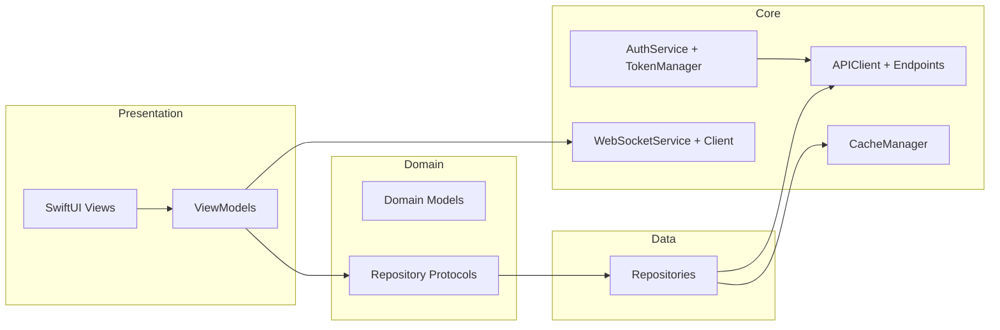
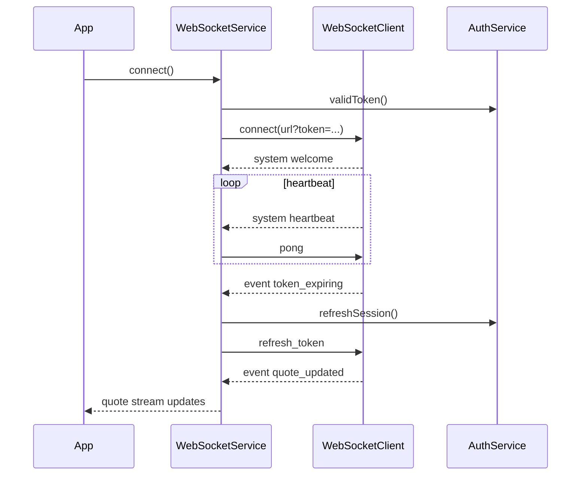

# Growfolio iOS

Growfolio is an iOS 17+ SwiftUI app for portfolio tracking, funding, DCA, and AI insights. The project follows Clean Architecture and integrates real-time updates via WebSockets.

## Highlights (Current State)

- SwiftUI + Observation (`@Observable`, `@MainActor`).
- Clean Architecture folders: App, Core, Domain, Data, Mock, Presentation.
- Apple Sign In -> token exchange (`/api/v1/auth/token`).
- WebSocket service for real-time updates (quotes, transfers refresh, and event/ack streams).
- XCTest coverage for models, repositories, and key services (including new WebSocket parsing/service tests).

## Project Structure

```
Growfolio/
  App/            App entry, configuration, constants
  Core/           Networking, auth, storage, shared utilities
  Domain/         Models and repository protocols
  Data/           Repository implementations
  Presentation/   SwiftUI views + view models
  Mock/           Mock repositories and data generators
GrowfolioTests/   XCTest target mirroring app structure
```

## Architecture



## Authentication

- Uses Sign in with Apple to obtain an identity token (JWT).
- Exchanges token with backend:
  - `POST /api/v1/auth/token`
  - Response includes `user_id`, `email`, `name`, `alpaca_account_status`.
- Tokens are stored in `TokenManager` (Keychain + in-memory cache).

## WebSocket (Real-Time)

- URL built from environment: `wss://api.growfolio.app/api/v1/ws`.
- Query items: `token`, `device_type=ios`, `app_version`.
- Heartbeats: server sends `system` heartbeat, client replies with `pong`.
- Token refresh: on `token_expiring`, client refreshes via `AuthService` and sends `refresh_token`.

### WebSocket Lifecycle



### Current WebSocket Coverage

- Implemented:
  - Connection lifecycle, reconnect backoff, close-code handling.
  - Subscribe/unsubscribe for channels, quotes subscription by symbol.
  - Event stream (generic) and ack stream.
  - Quote updates feeding Watchlist/Stock Detail.
  - Transfer events trigger Funding refresh.
- Not yet wired to UI:
  - Orders, positions, account, DCA, baskets events (streams are available, consumers not yet implemented).

## Mock Mode

- Enabled via `MockConfiguration.shared.isEnabled`.
- Default in Debug (can be toggled in Settings).
- Mocks live in `Growfolio/Mock/` and power previews/tests.

## Build & Test

- Build (Swift Package target):
  - `swift build`
- Run all tests:
  - `swift test`
- Run a single test class:
  - `swift test --filter DashboardViewModelTests`
- Build iOS app:
  - `xcodebuild -project Growfolio.xcodeproj -scheme Growfolio -configuration Debug build`
- iOS simulator tests:
  - `xcodebuild -project Growfolio.xcodeproj -scheme Growfolio test -destination 'platform=iOS Simulator,name=iPhone 15'`
- Regenerate Xcode project:
  - `xcodegen generate`

## Configuration

- Environment URLs and flags: `Growfolio/App/Configuration/Environment.swift`.
- App constants: `Growfolio/App/Configuration/Constants.swift`.

## Testing Notes

- XCTest is used throughout; tests mirror app structure in `GrowfolioTests/`.
- New WebSocket tests validate parsing and service behaviors.
- Some repository tests are flagged as TODO due to SIGBUS (see test files for details).

## Contributing

- Follow Swift naming conventions and project architecture.
- Prefer repository protocols from `Growfolio/Domain/Repositories/Protocols/`.
- JSON decoding: `.convertFromSnakeCase`; encoding: `.convertToSnakeCase`.

## Quick Pointers

- WebSocket service: `Growfolio/Core/Network/WebSocketService.swift`
- WebSocket models: `Growfolio/Core/Network/WebSocketModels.swift`
- Auth: `Growfolio/Core/Authentication/AuthService.swift`
- Tokens: `Growfolio/Core/Authentication/TokenManager.swift`
